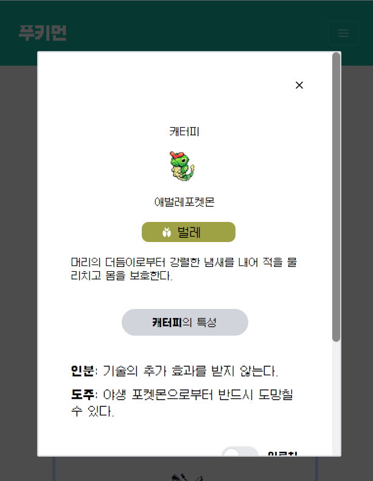

### fullfeet - pookimon

Learning about React and Coded it.

This website is not designed for profit, it is a private project. 

[fullfeet-pookimon](https://fullfeet-pookimon.netlify.app/)

## Preview

<br>

<br>

<br>

<br>
<br>

## App Structure

```
src
|-- api
|   |-- itemApi.jsx
|   |-- pokemonApi.jsx
|-- components
|   |-- item
|   |-- | --itemCard.jsx
|   |-- | --itemDetail.jsx
|   |-- pokemon
|   |-- | --pokemonCard.jsx
|   |-- | --pokemonDetail.jsx
|   |-- header.jsx
|   |-- loader.jsx
|   icons
|   |-- bug.svg (...pokemonType)
|-- styles
|   |-- index.css
|-- color.jsx
|-- icon.jsx
|-- Pokemon.jsx
|-- Tool.jsx
|-- index.jsx
```